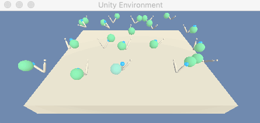

# DRLND-Continuous-Control
This is the second project of Udacity Deep Reinforcement Learning Nanodegree Program. In this project, I implemented Policy-Based RL algorithms in the [Reacher](https://github.com/Unity-Technologies/ml-agents/blob/master/docs/Learning-Environment-Examples.md#reacher) environment and the goal of my agent is to maintain its position at the target location for as many time steps as possible.

## Demo

 

I've implement deep reinforcement learning algorithm with Pytorch. 
In this project, the following algorithms have been implemented:

- [x] Proximal Policy Optimization (PPO)

