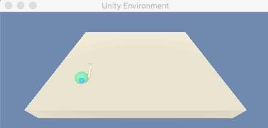
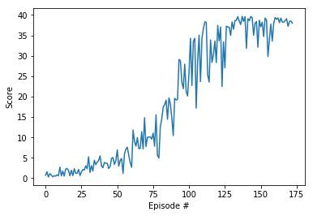
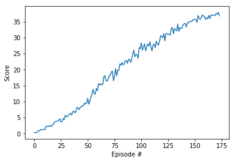

# DRLND-Continuous-Control
This is the second project of Udacity Deep Reinforcement Learning Nanodegree Program. In this project, I implemented Policy-Based RL algorithms in the [Reacher](https://github.com/Unity-Technologies/ml-agents/blob/master/docs/Learning-Environment-Examples.md#reacher) environment and the goal of my agent is to maintain its position at the target location for as many time steps as possible.

## Demo

 

I've implement deep reinforcement learning algorithm with Pytorch. 
In this project, the following algorithms have been implemented:

- [x] Proximal Policy Optimization (PPO)
- [x] Deep Deterministic Policy Gradients (DDPG)

## Project Details

In this environment, a double-jointed arm can move to target locations. A reward of +0.1 is provided for each step that the agent's hand is in the goal location. Thus, the goal of your agent is to maintain its position at the target location for as many time steps as possible.

The observation space consists of 33 variables corresponding to position, rotation, velocity, and angular velocities of the arm. Each action is a vector with four numbers, corresponding to torque applicable to two joints. Every entry in the action vector should be a number between -1 and 1.

### Solving the Environment

### Version 1
The first version contains a single agent and the task is episodic. In order to solve this environment, I implemented the DDPG algorithm and the agent is able to get an average score of +30 (over 100 consecutive episodes) in 172 training episodes.

 

### Version 2
The second version contains 20 identical agents, each with its own copy of the environment. In order to solve this environment, I implemented the PPO algorithm and the agents are able to get average score of +30 scores (over 100 consecutive episodes) in 176 training episodes.

 

## Getting Started

1. Download Version 1 Environment: One (1) Agent:
    - Linux: [click here](https://s3-us-west-1.amazonaws.com/udacity-drlnd/P2/Reacher/one_agent/Reacher_Linux.zip)
    - Mac OSX: [click here](https://s3-us-west-1.amazonaws.com/udacity-drlnd/P2/Reacher/one_agent/Reacher.app.zip)
    - Windows (32-bit): [click here](https://s3-us-west-1.amazonaws.com/udacity-drlnd/P2/Reacher/one_agent/Reacher_Windows_x86.zip)
    - Windows (64-bit): [click here](https://s3-us-west-1.amazonaws.com/udacity-drlnd/P2/Reacher/one_agent/Reacher_Windows_x86_64.zip)

2. Download Version 2 Environment: Twenty (20) Agents:
    - Linux: [click here](https://s3-us-west-1.amazonaws.com/udacity-drlnd/P2/Reacher/Reacher_Linux.zip)
    - Mac OSX: [click here](https://s3-us-west-1.amazonaws.com/udacity-drlnd/P2/Reacher/Reacher.app.zip)
    - Windows (32-bit): [click here](https://s3-us-west-1.amazonaws.com/udacity-drlnd/P2/Reacher/Reacher_Windows_x86.zip)
    - Windows (64-bit): [click here](https://s3-us-west-1.amazonaws.com/udacity-drlnd/P2/Reacher/Reacher_Windows_x86_64.zip)

3. Place the files in this directory, in the `unity_env` folder, and unzip (or decompress) the files. 

## Instructions
To train your model to solve the first version of environment (one agent), simply run

`python main.py --algo=DDPG`

To train your model to solve the second version of environment (twenty agents), simply run

`python main.py --algo=PPO`

## References
- [DeepRL](https://github.com/ShangtongZhang/DeepRL)
- [Deep Deterministic Policy Gradient](http://www.cs.sjsu.edu/faculty/pollett/masters/Semesters/Spring18/ujjawal/DDPG-Algorithm.pdf)
- [OpenAI Spinning Up](https://spinningup.openai.com/en/latest/) 
- Framework provided by Udacity Deep Reinforcement Learning Nanodegree Program.

